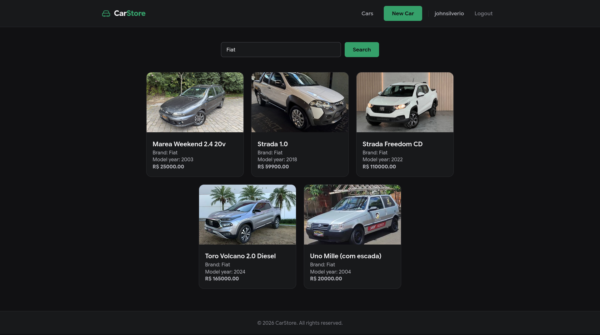

# Car Store

Car Store is a server-side rendered web application built with Django for managing a vehicle inventory.

<p align="center">
  
</p>

It allows users to register cars, associate them with brands, upload vehicle photos, and perform complex searches across the database. This project serves as a practical study of Django's architecture, ORM, and template engine following Clean Code principles.

## Features

- **Inventory Management:** Add new cars with details such as model, brand, factory year, model year, plate, price, and photo.
- **Advanced Search:** Search for vehicles matching either the car model or the brand name simultaneously using Django ORM's `Q` objects.
- **Image Handling:** Seamless image upload and serving for car photos.
- **Clean UI:** Responsive and minimalist user interface built with HTML5 and custom CSS.

## Prerequisites

- [Python](https://www.python.org/) 3.10 or later
- [PostgreSQL](https://www.postgresql.org/) (for production)

## Setup

Clone the repository and navigate to the project directory:

```bash
git clone https://github.com/johnsilverio/car-store.git
cd car-store
```

Create and activate a virtual environment:

```bash
python -m venv .venv
source .venv/bin/activate
```

Install the dependencies:

```bash
pip install -r requirements.txt
```

Set up your environment variables. Copy `.env.example` to `.env` and configure your PostgreSQL database credentials:

```env
DB_NAME=carstore
DB_USER=postgres
DB_PASSWORD=yourpassword
DB_HOST=localhost
DB_PORT=5432
```

Apply the database migrations:

```bash
python manage.py migrate
```

Start the development server:

```bash
python manage.py runserver
```

## Tech stack

- **Backend:** Python, Django
- **Database:** PostgreSQL (Production) / SQLite (Development)
- **Frontend:** Django Templates, HTML5, CSS3
